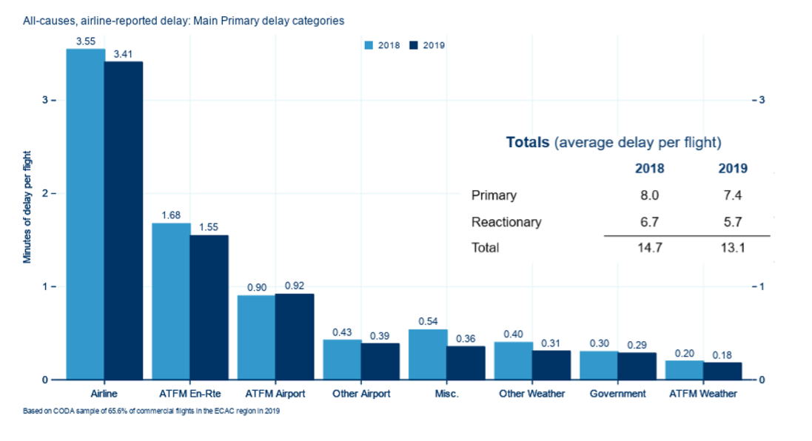

# Air traffic delay

## Definition
Statistical reports on all causes of delay.

## EUROCONTROL recommended sources

Value
:   
    ```{r, all-causes-airline-reported-delay-plot}
    
    ```

Source
:   EUROCONTROL CODA (2019) All-Causes Delay to Air Transport in Europe
  https://www.eurocontrol.int/sites/default/files/2020-04/eurocontrol-coda-digest-annual-report-2019.pdf

## Description

The report identified in the source value gives an overview of the delay
situation in the European Civil Aviation Conference area.
It has been prepared by the Central Office for Delay Analysis (CODA),
a EUROCONTROL service. It is based on delay data provided directly by airlines.
This data on all causes of delay is derived by airlines, comparing actual
timings with their published schedules.

Statistics on all causes of delay can be obtained directly from the
CODA Interactive Dashboard (CID) (a request for access is required).
This dashboard aims to provide the user with an enhanced understanding of
the causes of delay to flights, both that relating to air traffic flow
management (ATFM) and non-ATFM-related delay.
ATFM delay constitutes only a fraction of primary delays from all causes, and
around half of all delay is reactionary rather than primary.
Analyses within the dashboard are based on flight-by-flight data provided by
airspace users as well as the Network Manager.

More information about CODA can be found at
https://www.eurocontrol.int/network-performance (go to CID).


## Related standard inputs

[Air traffic statistics and forecast](#air-traffic-statistics-and-forecasts),
[flow management delay] and [cost of delay].

