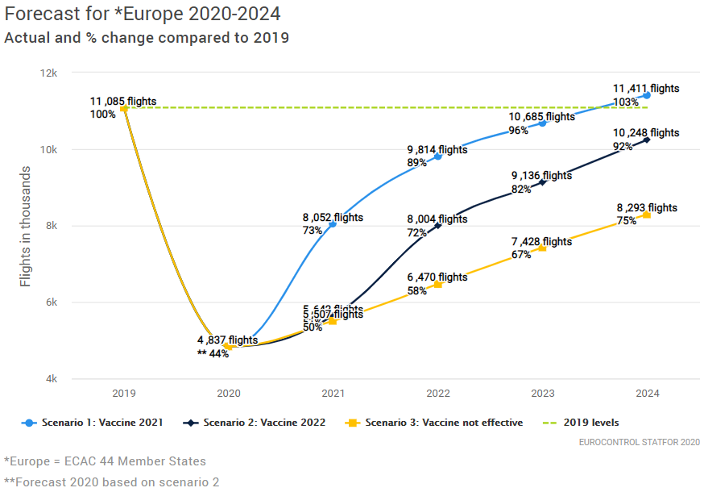

# Air traffic statistics and forecasts

## Definition
Actual and forecast numbers of flights and service units.

## EUROCONTROL recommended source

```{r, conversion-values}
library(gt)
library(magrittr)
library(tibble)

tribble(
  ~what, ~description,
  "Source", "EUROCONTROL Statistics and Forecasts Service (STATFOR)</br> [https://www.eurocontrol.int/forecasting](https://www.eurocontrol.int/forecasting)"
) %>% 
  gt() %>% 
  fmt_markdown(columns = TRUE) %>% 
  tab_options(column_labels.hidden = TRUE)

```


## Description

The objective of the Statistics and Forecast (STATFOR) service is to provide statistics and forecasts on air traffic in Europe and to monitor and analyse the evolution of the air transport Industry.

It produces the following:

* Seven-year forecasts
  The 7-year forecasts give a comprehensive picture of anticipated
  air traffic development in Europe for the next seven years.
  They combine flight statistics with economic growth and models of
  other industry drivers, including costs, airport capacity,
  passenger numbers, load factors and aircraft size.
  Using high- and low-growth scenarios, they present a likely range
  for growth, to help planners manage risks.
  We publish them biannually, in spring and autumn, covering flights,
  and en route and terminal service units every year.
* Twenty-year forecasts
  The 20-year forecasts look at a range of distinct possible scenarios
  for how the air traffic industry might look in 20 years’ time.
  This allows a range of ‘what if?’ questions to be explored, for factors
  inside the industry (e.g. the growth of small business jets,
  or of point-to-point traffic) or outside the industry (e.g. the price
  of oil or environmental constraints).
  Twenty-year forecasts are usually published every two to three years.
* Ad-hoc publications, such as the Challenges to Growth reports,
  trends in air traffic studies and other analyses can be found
  in the EUROCONTROL library: https://www.eurocontrol.int/library

Traffic statistics and forecasts can be obtained directly from the 
**STATFOR Interactive Dashboard (SID)**: 
https://www.eurocontrol.int/dashboard/statfor-interactive-dashboard.


## Related standard inputs

[Medium-term capacity planning], [air traffic delay], [flow management delay]
and [cost of delay].


## Comments

The following chart (status: November 2020) shows the traffic forecast taking account of the impact of COVID.

```{r, traffic-forecast-covid}

```

Source: EUROCONTROL STATFOR 2020, https://www.eurocontrol.int/covid19
