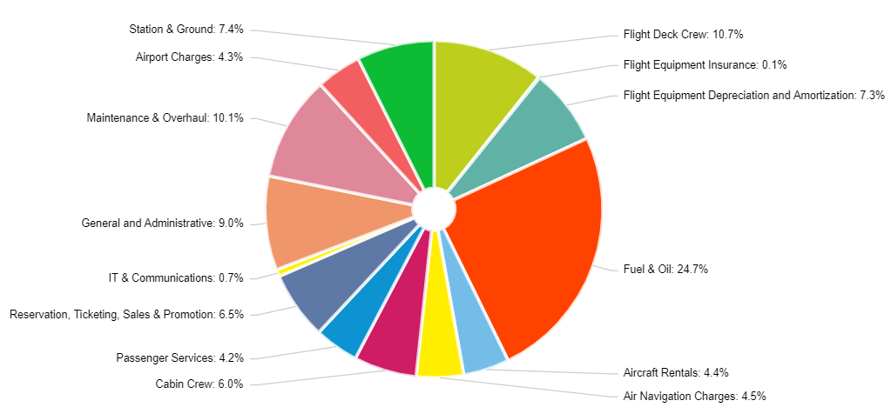

# Aircraft Operating Costs

## Definition

Flight and ground costs linked to the operation of an aircraft, such as fuel and oil, flight deck crew, flight equipment depreciation and amortisation, aircraft rentals, landing fees, ground handling, aircraft parking, air bridges and maintenance.

## EUROCONTROL recommended sources

Value

:   \`\`\`{r, flight-operating-cost} library(tibble) library(gt)

    tribble( \~act, \~cost_yr, \~cost_fh, \~cost_cycle, \~cost_seat_km, \~cost_ton_km, "B737 NG" , 14.11, 4337, 9231, 3.76, 33.11, "A320 Family" , 12.84, 4829, 8851, 3.60, 36.92, "B737 Classic", 8.26, 2683, 5366, 2.96, 25.28, "B777" , 40.01, 9507, 60367, 3.53, 22.07, "A330" , 29.87, 7827, 35857, 3.61, 24.48, "B757" , 18.21, 5357, 18508, 3.73, 30.51, "B767" , 26.00, 6675, 40899, 3.61, 22.18, "B787" , 30.58, 7184, 50827, 3.11, 19.86, "EMB-190" , 10.87, 4097, 5770, 6.35, 54.00, "Dash 8" , 4.03, 1921, 1921, 6.12, 58.08 ) %\>% gt() %\>% tab_header( title = "Flight operating costs (in \$ 2019 prices)" ) %\>% cols_label( act = "Aircraft type", cost_yr = "per aircraft per year (M\$)", cost_fh = "per flight hour", cost_cycle = "per flight cycle", cost_seat_km = "per available seat Km (US cents)", cost_ton_km = "per available ton km (US cents)" ) %\>% opt_align_table_header(align = "left")

    \`\`\`

Source

:   Values provided by IATA Airline Cost Management Group (ACMG[^aircraft_operating_costs-1])<br>\
    <https://www.iata.org/en/programs/workgroups/airline-cost-mgmt/>

[^aircraft_operating_costs-1]: IATA industry group focusing on matters concerning airline costs and measures to optimise them

## Description

The above values, provided by IATA, refer to the 2020 ACMG data collection (fiscal year 2019) and provide an overview of the operating costs for 10 types of aircraft (B737 NG, A320 family, B737 Classic, B777, A330, B757, B767, B787, EMB-190 and Dash 8).

The IATA Airline Cost Management Group (ACMG) collects operating costs classified into three categories, which are defined as follows:

-   [Flight operating expenses]{.ul} are direct operating expenses. They are directly related to the aircraft and the flight activities of an airline, such as flight crews, fuel, flight equipment and navigation. The biggest component of flight operating expenses is fuel and oil at 48%.
-   [Ground operating expenses]{.ul} are also direct operating expenses. They are directly related to the ground activities of an airline, such as maintenance and overhaul, airport charges, station and ground. Maintenance and overhaul is the biggest cost component at 46%.
-   [System operating expenses]{.ul} are overheads and indirect operating expenses. They are not directly related to flight or ground operating expenses. They include costs for cabin attendants, passenger service, load insurance, reservations, ticketing, sales and promotion, IT and communications, and general and administrative costs, with the latter representing 34% of total system operating expenses.

```{r, operating-costs,out.width="49%",out.height="20%",fig.show='hold',fig.align='center'}
knitr::include_graphics(c("figures/total_operating_cost.png",
                          "figures/ground_operating_cost.png",
                          "figures/flight_operating_cost.png",
                          "figures/system_operating_cost.png"))
```

The airline cost structure for 2019:

```{r, airline-costs}

```

The values used for analysis are the result of aggregating the cost data provided by 51 airlines worldwide, covering over 35% of the industry in terms of revenue passenger kilometres (RPKs), with European airlines representing 16% of the share and 12% in terms of passengers carried.

[Note from IATA]{.ul} \
In a number of jurisdictions, airport charges and taxes which are levied on a per-passenger basis are not accounted for in airline profit and loss accounts. As a result, the share of airport charges is likely to be significantly understated, as airports may levy more on a per-passenger or per-aircraft basis in some jurisdictions. To give an order of magnitude, in some regions the ACI (Airports Council International) estimates that over 50% of airport charges are collected on a per-passenger basis, reaching as much as 80% in some regions worldwide.

## Related standard inputs

## Comment
