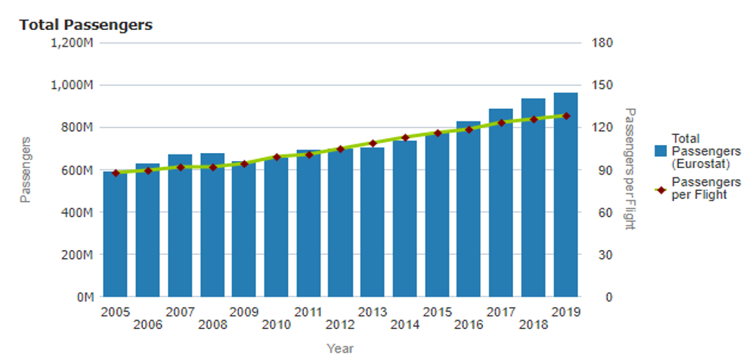

# Average number of passengers per movement

## Definition
Average^[In this context, the (arithmetic) mean value] number of passengers per
movement (take-off or landing) in Europe.


## EUROCONTROL recommended sources

Value
:   
    ```{r, average-number-of-passengers}
    library(tibble)
    library(gt)
    library(tidyr)
    
    tribble(
      ~ year, ~ n_pax,
      2013, 109,
      2014, 113,
      2015, 117,
      2016, 119,
      2017, 124,
      2018, 126,
      2019, 129
    ) %>% 
      pivot_wider(names_from = year, values_from = n_pax) %>% 
      gt() %>% 
      tab_header(title = "Average number of passengers per departing flight",
                 subtitle = "EU-27+UK and EFTA") %>% 
      tab_footnote(
        footnote = "European Free Trade Association: Iceland, Liechtenstein, Norway and Switzerland",
        locations = cells_title(groups = c("subtitle"))
      ) %>% 
      opt_align_table_header(align = "left")
    ```

    ```{r, total-passengers-graph}
    
    ```


Source
:   Eurostat: air passenger transport by reporting country (extract: avia_paoc)  
    http://ec.europa.eu/eurostat/web/transport/data/database  
    EUROCONTROL STATFOR Interactive Dashboard (SID)19 (goto PAX+)  
    https://www.eurocontrol.int/dashboard/statfor-interactive-dashboard

Description
:   The average number of passengers per movement^[A movement is either a take-off or a landing at an airport.] for a given year is obtained by dividing the number of ‘departing passengers on board’ by the number of ‘departing flights for that year’.


## Description

The Eurostat air transport domain contains national and international intra- and extra-EU data. This provides air transport data for passengers (in numbers of passengers) and for freight and mail (in thousands of tonnes) as well as air traffic data for airports, airlines and aircraft. Data are transmitted to Eurostat by the Member States of the European Union as well as the candidate countries Iceland, Norway and Switzerland. The air transport data have been calculated using data collected at airports.


## Other possible value

Value
:   
    ```{r}
    library(tibble)
    library(gt)
    tribble(
      ~ year, ~ pax,
      2008,  96,
      2010, 102,
      2012, 108,
      2013, 111,
      2015, 118,
      2017, 125
    ) %>% 
      pivot_wider(names_from = year, values_from = pax) %>% 
      gt() %>% 
      tab_header(title = "Passengers per IFR movement",
                 subtitle = "Values for the main 34 European airports (all operations)") %>% 
      opt_align_table_header(align = "left")
    ```

Source
:   PRC and FAA, “2017 Comparison of ATM-related operational performance: US – Europe”,
    March 2019 (page 25):  
    https://www.eurocontrol.int/publication/useurope-comparison-air-traffic-management-related-operational-performance-2017  
    Reports from previous years are available in the EUROCONTROL library:  
    https://www.eurocontrol.int/library.
    
Description
:   The table below provides high-level indicators for the main 34 airports21 in Europe using data reported by the airports.  
    The number of passengers per IFR movement is calculated by dividing the ‘average number of annual passengers per airport’ 
    ```{r}
    library(tibble)
    library(gt)
    tribble(
      ~ year, ~ pax,
      2008, 25,
      2010, 24,
      2012, 25,
      2013, 25,
      2015, 28,
      2017, 31
    ) %>% 
      pivot_wider(names_from = year, values_from = pax) %>% 
      gt() %>% 
      tab_header(title = "Average number of annual passengers per airport (million)") %>% 
      opt_align_table_header(align = "left")

    ```
    by the ‘average number of annual IFR movements per airport’.  
    ```{r}
    library(tibble)
    library(gt)
    tribble(
      ~ year, ~ ifr,
      2008, 260,
      2010, 237,
      2012, 233,
      2013, 228,
      2015, 223,
      2017, 248
    ) %>% 
      pivot_wider(names_from = year, values_from = ifr) %>% 
      gt() %>% 
      tab_header(title = "Average number of annual IFR movements per airport (‘000)") %>% 
      opt_align_table_header(align = "left")

    ```


## Related standard inputs

## Comment

