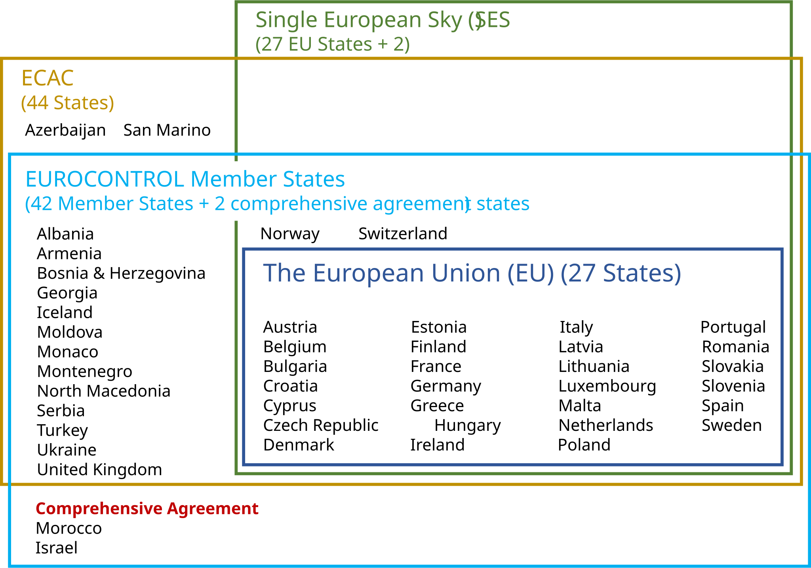
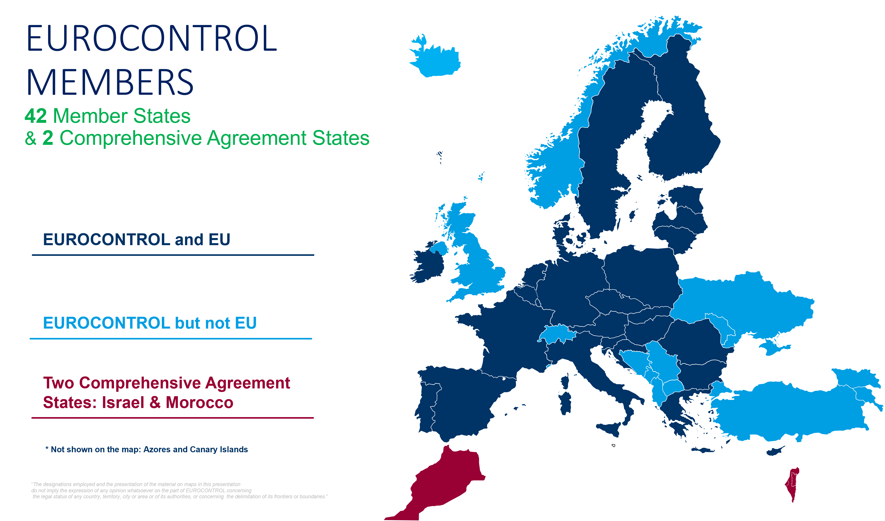
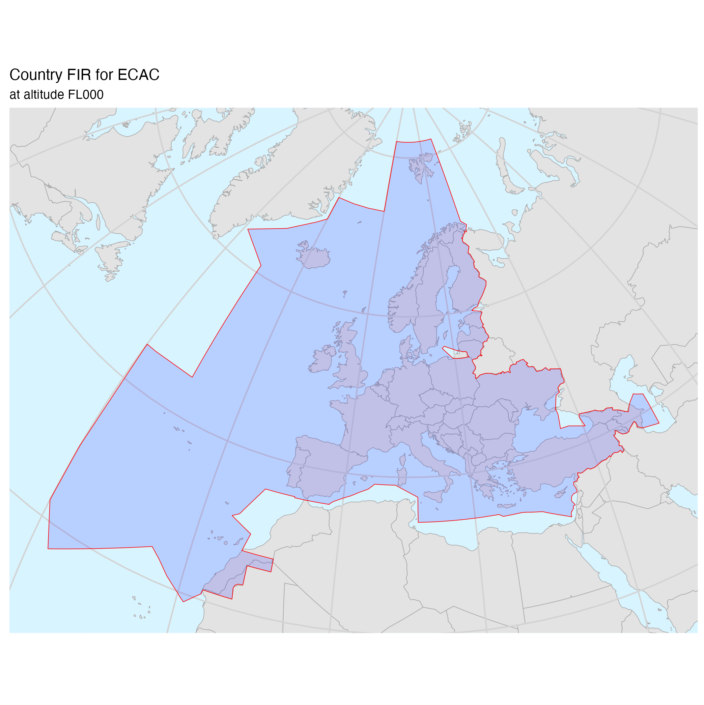

# Geographical areas {#sec-geographical-areas .unnumbered}

## Member States and geographical areas covered {.unnumbered}

Single European Sky, the European Civil Aviation Conference (ECAC), the European 
Union (EU) and EUROCONTROL are the different scopes covered in this document.

@fig-member-states-set-diagram shows a summary of the States that are included 
in the different groupings relevant to the aviation domain, while @fig-eurocontrol-member-states 
shows a map of the EUROCONTROL Member and Comprehensive Agreement States.

{#fig-member-states-set-diagram}

## EUROCONTROL Member States {.unnumbered}

{#fig-eurocontrol-member-states}

## Airspace of the ECAC Member States {.unnumbered}

ECAC is an intergovernmental organisation that was established by ICAO and the 
Council of Europe. ECAC now has 44 Member States, including all 27 EU Member 
States, 31 of the 32 European Union Aviation Safety Agency Member States, and 
all 42 EUROCONTROL Member States. 

@fig-ecac-airspace-fir is a graphical representation of the airspace belonging to the ECAC states.

{#fig-ecac-airspace-fir}
