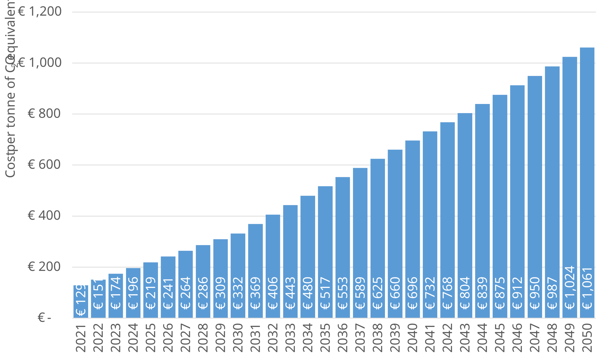

# Shadow cost of carbon {#sec-shadow-cost-of-carbon}

## EUROCONTROL recommended values

The shadow cost of carbon is the cost of carbon required to drive the economy to
meet the 1.5°C global temperature target set by the Intergovernmental Panel on 
Climate Change (IPCC). The values have been estimated based on the data provided 
by the European Investment Bank (EIB) in their 2021-2025 roadmap [@eib:2020] and represent
the cost in euros per tonne of CO~2~ equivalent.

The input is an adjustment of the EIB recommended values to reflect the most
realistic cost of meeting the [Paris Climate Agreement](https://unfccc.int/process-and-meetings/the-paris-agreement/the-paris-agreement) 
to limit global warming well below 2 degrees Celsius, ideally 1.5 – compared to pre-industrial levels [@ipcc:2018]. 
Please note that this input does not refer to the traditional market price but 
to the shadow cost of carbon (i.e. considering externalities and future policies).
The original EIB proposed inputs are expressed in 2016 prices  and have been 
adjusted to 2025 price levels using the values provided in @tbl-inflation-table.

{#fig-cost-of-carbon}

## Comment

In economic analyses the concept of ‘shadow cost’ is often used when working with
an abstract commodity or intangible asset. Typically, two elements are reflected 
in the ‘shadow cost’:

* The cost of negative externalities such as pollution in this case
* The shadow cost involves the consideration of future policies

Shadow costs are inexact by definition, as they are based on assumptions, but 
their usefulness resides in that they help to understand the full socio-economic
merits of a project. Please note that the shadow cost of carbon does not 
constitute in any way an optimal value for any policy instrument.

## Other possible sources

-   *Climate Bank Roadmap Phase 2* [@eib:2025] 
    
    This report is a follow-up to the EIB Group  Climate Bank Roadmap  2021-2025
    published in 2020 and that contains the values presented in this chapter.
    Its objective is to provide an update to some of the data contained in the
    initial report.

## When to use the input?

This input is recommended for projects where the full socio-economic value of 
the initiative is studied, particularly involving the environmental assessment.

## Related inputs

@sec-rate-of-fuel-burn [Rate of fuel burn](#sec-rate-of-fuel-burn)

@sec-amount-of-emissions-released-by-fuel-burn [Amount of emissions released by fuel burn](#sec-amount-of-emissions-released-by-fuel-burn)

@sec-cost-of-emissions [Cost of emissions](#sec-cost-of-emissions)

@sec-proportion-of-saf [Proportion of ustainable aviation fuel](#sec-proportion-of-saf)

## References
