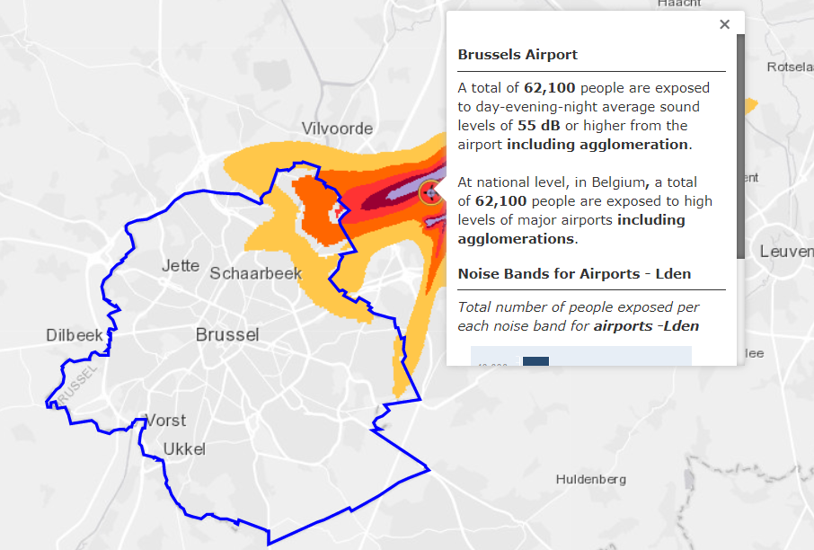

# Cost of noise

## Definition

Estimate of the cost of noise per person affected, taking into account both
the cost of annoyance and health costs due to exposure to traffic noise.

## EUROCONTROL recommended sources

Value 1
:   
    ```{r, aviation-traffic-noise-cost}
    library(gt)
    library(magrittr)
    library(tibble)
    tribble(
      ~ c1, ~ c2, ~ c3, ~ c4,
      "50-54",  36,  5,  41,
      "55-59",  72,  6,  78,
      "60-64",  72,  9,  81,
      "65-69", 136, 13, 148,
      "70-74", 136, 17, 152,
      "≥ 75", 136,  22, 158
    ) %>% 
      gt() %>% 
      cols_label(
        c1 = "Noise levels Lden in dB(A)",
        c2 = "Annoyance",
        c3 = "Health",
        c4 = "Total"
    ) %>% 
    tab_header(
      title = md("Environmental price of aviation traffic noise for the EU-27+UK"),
      subtitle = "for different noise levels, per person per dB (€2019/dB/person/year)"
    ) %>%
    tab_footnote(
      footnote = "adjusted from € 2016 to € 2019 prices",
      locations = cells_column_labels(vars(c2, c3, c4))) %>% 
    tab_footnote(
      footnote = "Lden is the common EU indicator which corresponds to the
                  average noise level throughout the day, evening and night to
                  which a citizen is exposed over the period of a year.
                  One fundamental feature of Lden is that it assumes that evening
                  and night-time noise is more of a nuisance than daytime noise.
                  (Evening noise is given a penalty of 5 dB(A).
                  Night-time noise is given a penalty of 10 dB(A).)",
      locations = cells_column_labels(columns = vars(c1))) %>% 
    tab_footnote(
      footnote = "The basic measurement index for noise is the decibel (dB).
                  It is indexed logarithmically, reflecting the logarithmic
                  manner in which the human ear responds to sound pressure.
                  Within the human range of hearing, deep and very high tones
                  at the same sound intensity are experienced as less noisy.
                  To correct for this sensitivity, a frequency weighting is
                  applied to measurements and calculations.
                  The most common frequency weighting is the
                  ‘A weighting’, dB(A).
                  Source: “Handbook on the external costs of transport”,
                  CE Delft, January 2019",
      locations = cells_column_labels(columns = vars(c1))) %>% 
    opt_align_table_header(align = "left")
    ```


Value 2
:   
    ```{r, airport-noise-cost}
    library(gt)
    library(magrittr)
    library(tibble)
    tribble(
      ~ c1, ~ c2, ~ c3, ~ c4, ~ c5, ~ c6,
      "Short-haul", NA_real_, NA_real_, NA_real_, NA_real_, 0.48,
      "Medium-haul", 0.88, 270, 2.16, 9.51, 0.12,
      "Long-haul", NA_real_, NA_real_, NA_real_, NA_real_, 0.01
    ) %>% 
      gt(rowname_col = "c1") %>% 
      cols_label(
        c2 = md("Total cost<br>€ billions"),
        c3 = "€/LTO",
        c4 = "€/pax",
        c5 = "€/tonne",
        c6 = "€-cent/km"
    ) %>% 
    fmt_missing(
      columns = 2:6,
      missing_text = ""
    ) %>%
    tab_header(
      title = md("Total and average noise cost for aviation for 33 selected EU airports")
    ) %>%
    tab_spanner(
      label = "Average cost",
      columns = vars(c3, c4, c5, c6)
    ) %>% 
    tab_footnote(
      footnote = "adjusted from € 2016 to € 2019 prices",
      locations = cells_column_labels(vars(c2, c3, c4, c5, c6))) %>% 
    tab_footnote(
      footnote = "Costs per pax include the complete flight
                  (not only the half-way principle).",
      locations = cells_column_labels(columns = vars(c3))) %>% 
    opt_align_table_header(align = "left")
    ```

Source 1 and 2
:   “Handbook on the external costs of transport”, CE Delft, January 2019
    (commissioned by European Union DG Move)<br>
    https://www.cedelft.eu/en/publications/2311/handbook-on-the-external-costs-of-transport-version-2019 <br>
    Also available from the Publications Office of the EU:<br>
    https://op.europa.eu/fr/publication-detail/-/publication/9781f65f-8448-11ea-bf12-01aa75ed71a1


## Description

The table above was extracted from a study carried out by CE Delft
(an independent research and consultancy organisation) on the external costs of
different types of transport in Europe (tables 33 and 36).
It gives an overview of the noise-related costs associated with people exposed
to different noise level bands due to aviation.
Two major aspects are considered in the study when assessing noise impact
and cost:

* Annoyance: This refers to the disturbance which individuals experience when
  they are exposed to noise (traffic noise in this case), e.g. discomfort,
  inconvenience.
* Health impacts caused by long-term exposure to noise.
  The most common symptoms are stress- related health problems.
  Evidence has not been strong for all noise-related health impacts, and
  consequently in the European Handbook on External Costs of Transport, only
  the following health impacts are considered: hypertension,
  ischaemic heart disease, stroke and dementia.
  Insomnia is not included in order to avoid double-counting with the costs of
  annoyance.

The environmental price of noise reflects the welfare loss which occurs with
one extra decibel (dB) of noise (CE Delft, 2018).
The environmental price of noise needs to be determined implicitly, as there
is no market for noise prevention. Previous editions of the
European Handbook on External Costs of Transport have recommended using
environmental prices based on HEATCO (2006), both for annoyance and
health endpoints.
HEATCO assumes a constant valuation per dB of noise for annoyance costs,
which has recently been disputed.
The new version of the Handbook therefore uses increasing prices per dB based
on the most recent insights provided by Bristow et al. (2015) for
annoyance costs.
As for health costs, the prices according to Defra (2014) match the WHO’s
recommendations in its latest systematic reviews, and are therefore used in
the European Handbook on External Costs of Transport.

Comparable values for road and rail noise costs are also presented in the same study.

Here is an example to show how the environmental price of noise should be
applied in calculations: the annual cost for a person exposed to 57dB(A)
of aviation noise would be equal to €439 (5dB x €41 + 3dB x €78).


## Other possible value

Value
:   
    ```{r, aviation-noise-marginal-cost}
    library(gt)
    library(magrittr)
    library(tibble)
    tribble(
      ~ c1, ~ c2, ~ c3, ~ c4,
      45, 46, 19, 47,
      50, 51, 48, 64,
      55, 56, 60, 82,
      60, 61, 78, 99,
      65, 66, 98, 117,
      70, 71, 119, 117,
      75, 76, 141, 117,
      80, 81, 153, 117
   ) %>% 
      gt() %>% 
      cols_merge_range(
        col_begin = vars(c1),
        col_end   = vars(c2)
      ) %>%
      cols_label(
        c1 = md("Increase in daytime noise metric by one decibel (dB)"),
        c3 = "Aviation noise marginal cost (excluding sleep disturbance)",
        c4 = "Sleep disturbance",
    ) %>% 
    tab_header(
      title = md("Aviation noise marginal cost (€/household/year)")
    ) %>%
    # tab_spanner(
    #   label = "",
    #   columns = vars(c1, c2)
    # ) %>% 
    tab_footnote(
      footnote = "adjusted from £ 2014 to € 2019 prices at the 2019 exchange rate",
      locations = cells_column_labels(vars(c3, c4))) %>% 
    opt_align_table_header(align = "left")
    ```

Source
:   UK Department for Environment, Food and Rural Affairs<br>
    Environmental Noise “Valuing impacts on: sleep disturbance, annoyance,
    hypertension, productivity and quiet”, November 2014
    (Annex I: Noise marginal values in 2014 prices
    Table A1.3 & Table A1.4 p.42-43)<br>
    https://www.gov.uk/government/uploads/system/uploads/attachment_data/file/380852/environmental-noise-valuing-imapcts-PB14227.pdf
    
Description
:   The value presents the results of an economic valuation tool developed by
    the UK Department for Environment, Food and Rural Affairs.
    It converts changes in noise exposure to estimated monetary values,
    in order to support the assessment of the effects of environmental noise.<br>
    The report details the current understanding of the links between
    environmental noise and various effects, including sleep disturbance,
    annoyance, hypertension and related diseases.<br>
    A range of sensitivities is available around these values from the Noise Modelling Tool (see report and excel file for more details https://www.gov.uk/guidance/noise- pollution-economic-analysis).


## Further reading

### WHO (2018)
“Environmental Noise Guidelines for the European Region”, World Health
Organisation (2018)

The World Health Organisation Regional Office for Europe has developed
environmental noise guidelines for the European region.
The main purpose of these guidelines is to provide recommendations for
protecting human health from exposure to environmental noise originating from
various sources, such as transportation (road traffic, railway and aircraft)
noise, wind turbine noise and leisure noise.

The guidelines focus on the WHO European region and provide policy guidance
to Member States which is compatible with the noise indicators used in the
European Union’s Directive 2002/49/EC.
For average noise exposure, the Guideline Development Group (GDG) strongly
recommends reducing noise levels produced by aircraft below 45 dB Lden and
for night noise exposure, below 40 dB Lnight.<br> https://www.euro.who.int/__data/assets/pdf_file/0008/383921/noise-guidelines-eng.pdf

### WHO (2009)
“Night noise guidelines for Europe”,

The World Health Organization (WHO) set the European target limit for outdoor
night noise levels at an annual average of 40 decibels (dB) in these guidelines.
This would protect the public, including the most vulnerable, such as children
and the elderly.<br>
http://www.euro.who.int/__data/assets/pdf_file/0017/43316/E92845.pdf


The reading suggested below broadens the scope of the cost of noise values with documents related to the overall noise levels and related rules and regulations.


### EASA/EEA/EUROCONTROL (2019)
“European Environmental Report"

This second European Aviation Environmental Report (EAER) provides an updated
assessment of the environmental performance of the aviation sector published in
the first report of 2016.
The continued growth of the sector has produced economic benefits and
connectivity within Europe, and is stimulating investment in novel technology.
This draws on a wider pool of expertise and innovative approaches from other
sectors, thereby creating potential new opportunities to address the environmental impacts of aviation.
It is, however, recognised that the contribution of aviation activities to
climate change, noise and air quality impacts is increasing, thereby affecting
the health and quality of life of European citizens.<br> https://www.eurocontrol.int/publication/european-aviation-environmental-report-2019


### EASA/EEA/EUROCONTROL (2019)
“Noise country fact sheets”

These country fact sheets summarise information on noise pollution for selected EEA member countries. The fact sheets are based on the latest official noise data reported every five years by EEA member countries under the Environmental Noise Directive (END).<br> https://www.eea.europa.eu/themes/human/noise/noise-fact-sheets


### EC (2002)
Environmental Noise Directive (END) 2002/49/EC

Directive 2002/49/EC relating to the assessment and management of environmental noise (the Environmental Noise Directive – END) is the main EU instrument to identify noise pollution levels and to trigger the necessary action both at Member State and at EU level.
The introduction of the END in 2002 sought to monitor the effectiveness of EU emission controls by requiring the assessment of environmental noise at Member State level. The Directive introduced two key indicators for annoyance and sleep disturbance, which, if exceeded, require action plans to be drawn up which are designed to reduce exposure and protect areas not yet polluted by noise.<br> https://eur-lex.europa.eu/legal-content/EN/TXT/?uri=CELEX:32002L0049

### EC (2014), Regulation (EU) No 598/2014
Regulation (EU) No 598/2014 establishes rules and procedures with regard to the introduction of noise-related operating restrictions at EU airports. It follows the guidelines of the ICAO Balanced Approach to Aircraft Noise Management and the rules defined to be applied to airports with more than 50 000 movements per year of civil aircraft.<br> https://eur-lex.europa.eu/legal-content/EN/TXT/?uri=CELEX:32014R0598


### European Parliament's Committee on Petitions (2020)
“Impact of aircraft noise pollution on residents of large cities”, ENVISA/ Study
requested by the EU Parliament

This study, provided by the Policy Department for Citizens' Rights and Constitutional Affairs at the request of the Committee on Petitions, aims to provide a clear and simple overview, for the non-expert reader, of the impact of aircraft noise pollution on residents of large cities, and to make recommendations addressed to the most relevant actors.<br> https://www.europarl.europa.eu/RegData/etudes/STUD/2020/650787/IPOL_STU(2020)650787_EN.pdf


### ACI and CANSO (2015)
“Managing the Impacts of Aviation Noise: A Guide for Airport Operators and Air Navigation Service Providers”

“Managing the Impacts of Aviation Noise” examines the problem of aviation noise and describes methods which airport operators and ANSPs can use to manage and reduce its impact. It reviews four current approaches to managing noise, namely reducing noise at the source, land use planning, noise-reducing operational procedures, and operating restrictions.<br> https://aci.aero/news/2015/09/23/aci-and-canso-launch-new-initiative-on-reducing-aviation-noise/


## Example of estimating a noise reduction benefit

The “cost of noise” values can be used to calculate potential benefits in research project CBAs (cost- benefit analyses) in order to measure the monetary gain of a noise improvement. An example is the SESAR 2020 project Enhanced Arrival Procedures (EAPs). In this case, noise benefits were calculated as the reduction in the noise contour around the airport area when a different EAP concept was applied. The change in the noise contour area results were calculated per decibel band. This value was then multiplied by the number of people affected around the airport within a radius of
10 km, and the value of the cost of noise per person. The cost of noise (see table 1) is also calculated per decibel band. For noise contour results, scenarios were tested and compared using EUROCONTROL IMPACT tool[^ https://www.eurocontrol.int/platform/integrated-aircraft-noise-and-emissions-modelling-platform].


As mentioned in the further reading section, the EU in 2002 published Directive 2002/49/EC relating to the assessment and management of environmental noise (the Environmental Noise Directive – END). The END, which is the main EU instrument to identify noise pollution levels, requires Member States to prepare and publish noise maps and noise management action plans every five years for major airports (more than 50 000 movements a year, including small aircraft and helicopters).<br> https://ec.europa.eu/environment/noise/directive_en.htm

The NOISE Observation & Information Service for Europe of the EEA provides an interactive map displaying the exposure to NOISE levels from roads, railways, airports and industry. The map for airports illustrates the exposure to noise from airports in Europe during the average day and average night period. The example below is Brussels Airport.<br>
https://noise.eea.europa.eu/

(ref:noise-at-bru) Exposure to noise from Brussels airport. 

```{r, noise-at-bru, fig.cap='(ref:noise-at-bru)'}

```

