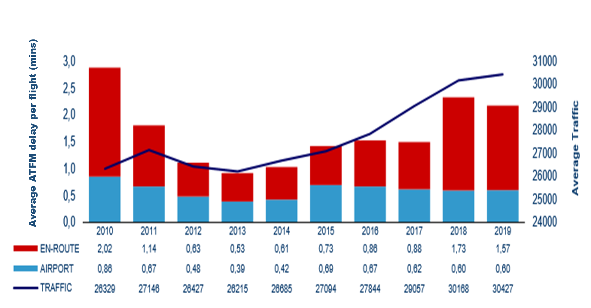

# Flow management delay

## Definition
Statistical reports on European ATM network performance in terms of the number
of flights and levels of air traffic flow management (ATFM) delay[^3].

[^3]: flights delayed by an ATFM regulation.

## EUROCONTROL recommended sources

Value
:   Daily traffic and ATFM delay per flight (en route and airport) 2009-2019
    ```{r, daily-traffic-atfm-delay-plot}
    
    ```

Source
:   EUROCONTROL NMD, Network Operations Report 2019<br>
    https://www.eurocontrol.int/sites/default/files/2020-04/nm-annual-network-operations-report-2019-main-report.pdf
    <br>
    Reports from previous years are available in the EUROCONTROL library:
    https://www.eurocontrol.int/library.

## Description

The EUROCONTROL Network Manager produces regular reports on the overall
performance of the network.
These help the Network Manager to monitor and understand how the network is
performing and to take action when a problem occurs.

The value above is extracted from a report providing an overview of
the European ATM network’s performance in the areas of traffic evolution,
capacity offered by the air navigation service providers and airports,
delays and flight efficiency.
The report analyses the annual results in light of the main events which took
place in the course of the year.
Airspace users’ opinions on network performance are also included.
This report is updated annually.

Information can be accessed and downloaded from the EUROCONTROL
Network Operations Monitoring and Reporting web page,
https://www.eurocontrol.int/network-performance, together with access criteria
for non-public reports or applications, and source/third party use.
The page also gives access to historical data.


## Related standard inputs

[Air traffic statistics and forecast](#air-traffic-statistics-and-forecasts),
[air traffic delay] and [cost of delay].


## Comments

Flow management delay differs from air traffic delay in that the latter relates
to both ATFM-related delay and non-ATFM-related delay.
Flow management delay, i.e. ATFM delay, constitutes only a fraction of
primary delay from all causes, and around half of all delay is reactionary
rather than primary.

Delay statistics for ECAC are also presented on a regular basis in the
Performance Review reports (PRRs), published annually by the
Performance Review Commission.
These publications can be found in the EUROCONTROL library: 
https://www.eurocontrol.int/library.
