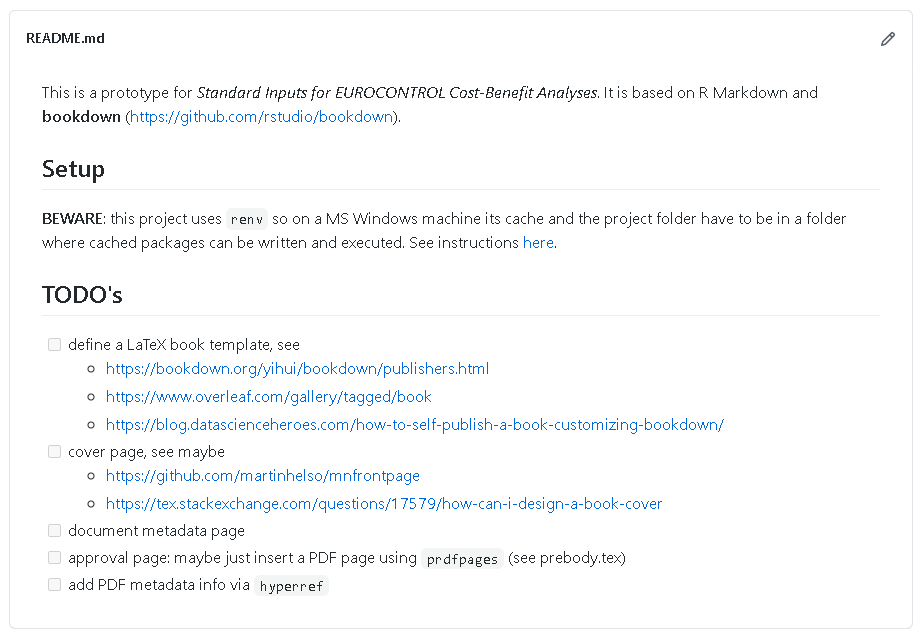
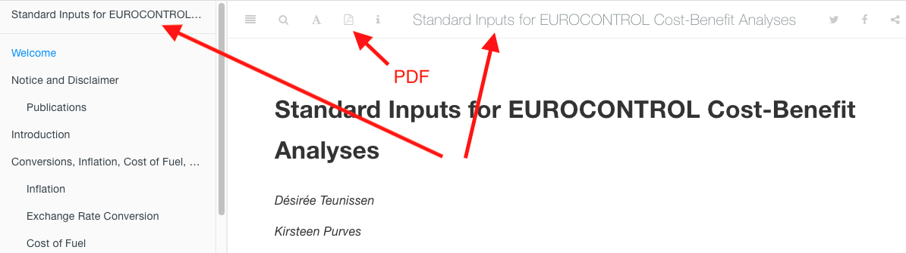
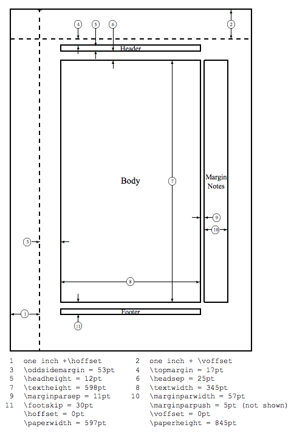
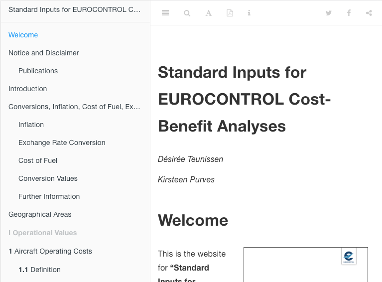

layout: true
background-image: url(../images/eurocontrol-logo-wide.svg)
background-position: 2% 99%
background-size: 18%


```{r setup, include=FALSE}
options(htmltools.dir.version = FALSE)

library(knitr)
knitr::opts_chunk$set(warning = FALSE, message = FALSE)
library(tidyverse)
# library(fontawesome) # from github: https://github.com/rstudio/fontawesome
library(icon) # from github: https://github.com/ropenscilabs/icon
library(ggwordcloud)
library(magrittr)
library(dplyr)

data("thankyou_words_small")
set.seed(1187)


subchunkify <- function(g, fig_height=7, fig_width=5) {
  g_deparsed <- paste0(deparse(
    function() {g}
  ), collapse = '')
  
  sub_chunk <- paste0("
  `","``{r sub_chunk_", floor(runif(1) * 10000), ", fig.height=", fig_height, ", fig.width=", fig_width, ", echo=FALSE}",
  "\n(", 
    g_deparsed
    , ")()",
  "\n`","``
  ")
  
  cat(knitr::knit(text = knitr::knit_expand(text = sub_chunk), quiet = TRUE))
}


```

---


# Outline


* List the requirements (no debate `r emo::ji("wink")`)
* Walk through, i.e. the practical steps to
  - understand the organization of the project
  - define/update/view the *doc*
  - publishing (`r emo::ji("cloud")`)


.bottom[

<small>
**Note**: unless you are really Really REALLY eager I would leave the `git`/`GitHub` nitty-gritty
details for another time.
*They are important* but they are sort of _technically shocking_ if you never went through
this kind of stuff...
</small>

]


---
# (Preliminary) Requirements - WebEx

My understanding from WebEx w/ Désirée and Kirsteen

1.	Possibility to publish the doc on the web publicly
1.	Possibility to generate web and PDF version from (mainly) the same source
1.	Possibility to publish on the web intermediate updates compared to the (bi-yearly?)
    PDF/paper version
1.	Traceability of changes in the various main/minor versions

---

# (Preliminary) Requirements - email feedback

* Interactive graphs
  - dashboard-like
  - tooltip-ish, ...
* Need for more of a Portal than a *bookdown*
* Sharing underlying data: how (Excel, ...)?
* site analytics
* visual identity

---

# Walk-through

This walk-through will show 

1. structure of the project
1. typical "editing" session
1. how the *cloud* helps out

---
background-image: none;


.right-column[
# Project organization
]

.left-column[
```{text , eval = FALSE, echo = TRUE}
+-- _bookdown.yml
+-- _output.yml
+-- _build.sh
+-- _common.R
+-- cover.pdf
+-- cover.png
+-- preamble.tex
+-- prebody.tex
+-- style.css
+-- index.Rmd
+-- ...
+-- <a bunch of .Rmd's>
+-- data
|   +-- ...
|   \-- inflation.csv
+-- figures
|   +-- ...
|   \-- airline_cost_structure.png
+-- images
|   +-- ...
|   \-- euctrl-logo.png
+-- _book
+-- DESCRIPTION         
+-- LICENSE.md          
+-- README.md           
+-- standard_inputs.Rproj
+-- R
    +-- ...
    \-- export_inflation.R
```
]

---
background-image: none;


.right-column[
# Project organization

* project files
]

.left-column[
```{text , highlight.output=c(1, 3), eval = FALSE, echo = TRUE}
+-- _bookdown.yml
+-- _output.yml
+-- _build.sh
+-- _common.R
+-- cover.pdf
+-- cover.png
+-- preamble.tex
+-- prebody.tex
+-- style.css
+-- index.Rmd
+-- ...
+-- <a bunch of .Rmd's>
+-- data
|   +-- ...
|   \-- inflation.csv
+-- figures
|   +-- ...
|   \-- airline_cost_structure.png
+-- images
|   +-- ...
|   \-- euctrl-logo.png
+-- _book                  
+-- DESCRIPTION            #<<
+-- LICENSE.md             #<<
+-- README.md              #<<
+-- standard_inputs.Rproj  #<<
+-- R
    +-- ...
    \-- export_inflation.R
```

]


---

# Walk-through: project files

--
* `.Rproj` are for RStudio IDE projects

--

* `DESCRIPTION` with `bookdown` is
  [used when you publish via TravisCI](https://bookdown.org/yihui/bookdown/github.html).
  `LICENSE.md` is about `r fontawesome(name = "copyright")`

--

* `README.md` is for the GitHub repo
  ```{r, echo=FALSE}
  
  ```


---
.right-column[
# Project organization

* project files
* YAML files and main Rmd
]

.left-column[
```{text , eval = FALSE, echo = TRUE}
+-- _bookdown.yml #<<
+-- _output.yml   #<<
+-- _build.sh     #<<
+-- _common.R     #<<
+-- cover.pdf
+-- cover.png
+-- preamble.tex
+-- prebody.tex
+-- style.css
+-- index.Rmd    #<<
+-- ...
+-- <a bunch of .Rmd's>
+-- data
|   +-- ...
|   \-- inflation.csv
+-- figures
|   +-- ...
|   \-- airline_cost_structure.png
+-- images
|   +-- ...
|   \-- euctrl-logo.png
+-- _book           #<<
+-- DESCRIPTION         
+-- LICENSE.md          
+-- README.md           
+-- standard_inputs.Rproj
+-- R
    +-- ...
    \-- export_inflation.R
```
]

---
# YAML files and main Rmd
## `_output.yml`
```{yml}
bookdown::gitbook:
  css: style.css
  config:
    toc:
      before: |
        <li>
          <a href="./">Standard Inputs for EUROCONTROL Cost-Benefit Analyses</a>
        </li>
    download: ["pdf"]

bookdown::pdf_book:
  includes:
    in_header: preamble.tex
    before_body: prebody.tex
  latex_engine: xelatex
  citation_package: natbib
  keep_tex: yes

```

---

# YAML files and main Rmd
## `_output.yml`
```{yml}
bookdown::gitbook:      #<<
  css: style.css        #<<
  config:               #<<
    toc:                #<<
      before: |         #<<
        <li>            #<<
          <a href="./">Standard Inputs for EUROCONTROL Cost-Benefit Analyses</a> #<<
        </li>           #<<
    download: ["pdf"]   #<<

bookdown::pdf_book:
  includes:
    in_header: preamble.tex
    before_body: prebody.tex
  latex_engine: xelatex
  citation_package: natbib
  keep_tex: yes

```



---

# YAML files and main Rmd
## `_output.yml`
```{yml}
bookdown::gitbook:
  css: style.css
  config:
    toc:
      before: |
        <li>
          <a href="./">Standard Inputs for EUROCONTROL Cost-Benefit Analyses</a>
        </li>
    download: ["pdf"]

bookdown::pdf_book:           #<<
  includes:                   #<<
    in_header: preamble.tex   #<<
    before_body: prebody.tex  #<<
  latex_engine: xelatex       #<<
  citation_package: natbib    #<<
  keep_tex: yes               #<<
```



---

# YAML files and main Rmd
## `_bookdown.yml`
```{yml}
# K-M (kint & merge) approach, see https://bookdown.org/yihui/bookdown/new-session.html
new_session: yes

book_filename: "standard_inputs"
delete_merged_file: true
output_dir: "_book"

# language:
#   ui:
#     chapter_name: "Chapter "

before_chapter_script: "_common.R"

rmd_files: [
  "index.Rmd",
  "introduction.Rmd",
  "conversions.Rmd",
  "geographical_areas.Rmd",
  #  Part: Operational Values
  "aircraft_operating_costs.Rmd",
  "passengers_per_movement.Rmd",
  "cancellation_cost.Rmd",
  "operational_cancellation_rate.Rmd",
  "cost_of_delay.Rmd",
  "cost_of_diversion.Rmd",
  "en_route_ans_costs.Rmd",
  #  Part: Safety Related Values
  "accident_incident_statistics.Rmd",
  # Part: Economic Values
  "ansps_employment_costs.Rmd",
  # Part: Environmental Values
  "amount_of_emissions.Rmd",
  # Part: Traffic and Capacity Related Values
  "aircraft_operating_costs.Rmd",
  "references.Rmd",
  "annexes.Rmd",
  "data.Rmd"
]```




---

.right-column[
# Project organization

* project files
* YAML files and main Rmd
* style  & Co.
  - [LaTeX](https://www.overleaf.com/learn/)
  - [CSS](https://www.w3schools.com/css/default.asp)
  - [Biblio style (LaTeX)](https://www.zotero.org/styles)
]

.left-column[
```{text , eval = FALSE, echo = TRUE}
+-- _bookdown.yml 
+-- _output.yml   
+-- _build.sh
+-- _common.R     
+-- cover.pdf    
+-- cover.png    
+-- preamble.tex #<<
+-- prebody.tex  #<<
+-- style.css    #<<
+-- index.Rmd    
+-- ...
+-- <a bunch of .Rmd's>
+-- data
|   +-- ...
|   \-- inflation.csv
+-- figures
|   +-- ...
|   \-- airline_cost_structure.png
+-- images                #<<
|   +-- ...               #<<
|   \-- euctrl-logo.png   #<<
+-- _book
+-- DESCRIPTION         
+-- LICENSE.md          
+-- README.md           
+-- standard_inputs.Rproj
+-- R
    +-- ...
    \-- export_inflation.R
```
]

---

.right-column[
# Project organization

* project files
* YAML files and main Rmd
* style  & Co.
* content: the *real thing*
]

.left-column[
```{text , eval = FALSE, echo = TRUE}
+-- _bookdown.yml 
+-- _output.yml   
+-- _build.sh
+-- _common.R     
+-- cover.pdf    
+-- cover.png    
+-- preamble.tex
+-- prebody.tex 
+-- style.css   
+-- index.Rmd                       #<<
+-- ...                             #<<
+-- <a bunch of .Rmd's>             #<<
+-- data                            #<<
|   +-- ...                         #<<
|   \-- inflation.csv               #<<
+-- figures                         #<<
|   +-- ...                         #<<
|   \-- airline_cost_structure.png  #<<
+-- images                
|   +-- ...               
|   \-- euctrl-logo.png   
+-- _book
+-- DESCRIPTION         
+-- LICENSE.md          
+-- README.md           
+-- standard_inputs.Rproj
+-- R                              #<< 
    +-- ...                        #<< 
    \-- export_inflation.R         #<<
```
]


---

# Editing session


<span style="font-size:10pt">Image from <a href="https://ontheline.trincoll.edu/bookdown.html">https://ontheline.trincoll.edu/bookdown.html</a></span>
---
# RMarkdown `r icon::fontawesome("markdown")`
---

# Automated preview / publishing 

